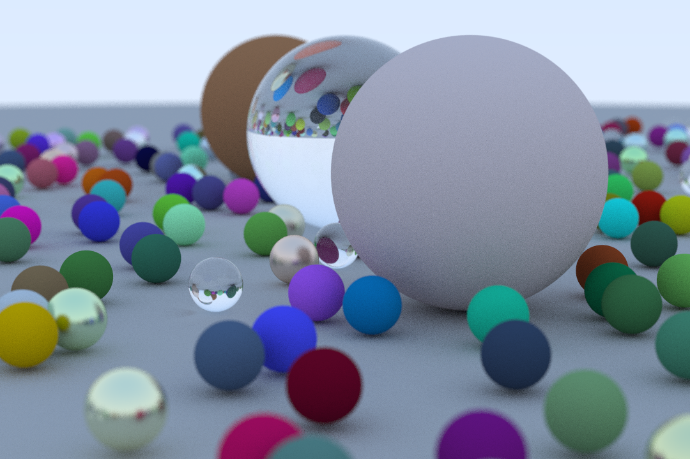
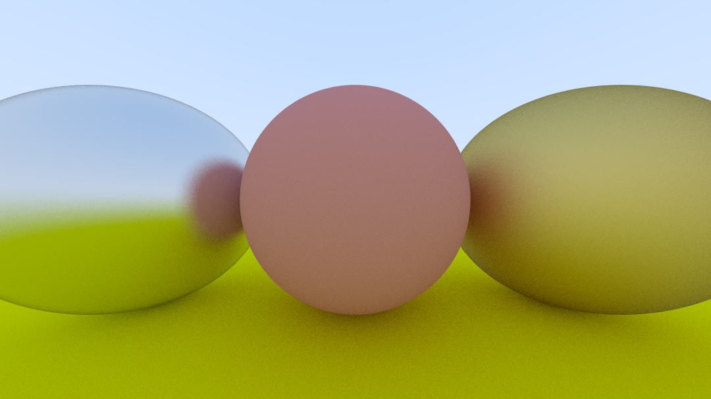
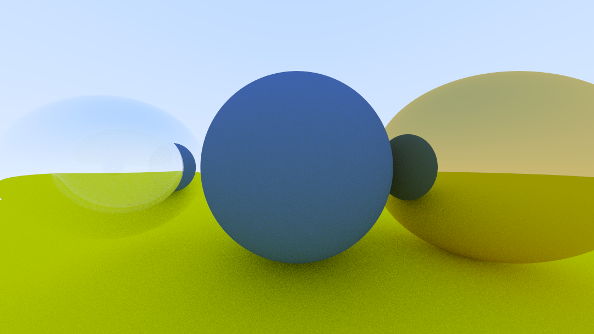
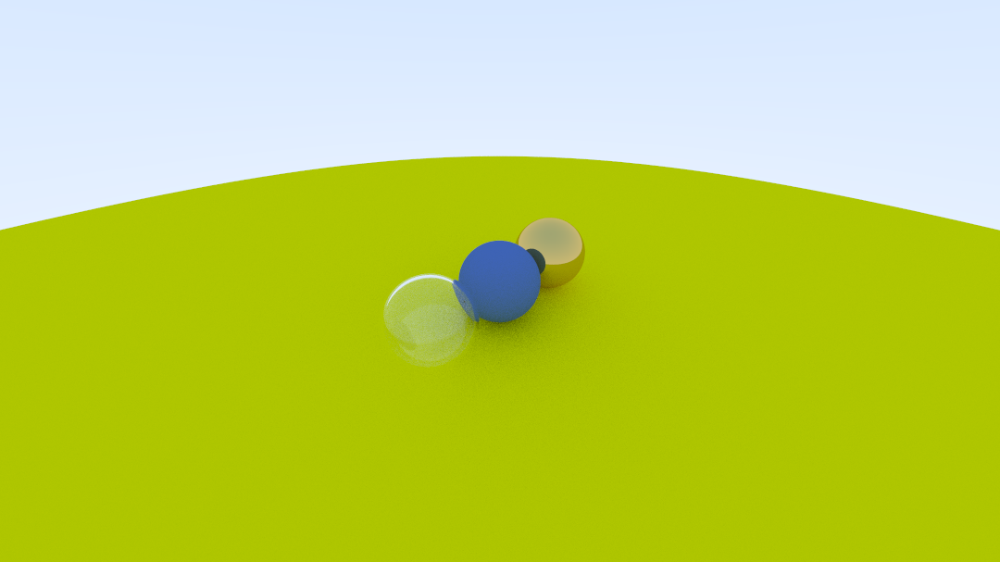

# Raytracing

Raytracing from scratch

## Ray Tracing in One Weekend 

Implementations of codes described in the book [Ray Tracing in One Weekend](https://raytracing.github.io/books/RayTracingInOneWeekend.html) by [Peter Shirley](https://github.com/petershirley).

### Compiling

To compile the project, open a terminal, go to the repository directory, and execute the following commands:

```bash
user@computer: ~/raytracing/ $ mkdir build && cd build
user@computer: ~/raytracing/build $ cmake ../
user@computer: ~/raytracing/build $ make
```

### Running

The program will render a scene with randomly positioned spheres in a fairly high resolution. The image data is redirected to the stdout and can be re-directed to a [PPM](https://en.wikipedia.org/wiki/Netpbm) image file using the following command:

```bash
user@computer: ~/raytracing/build $ ./main > image.ppm
Scanlines reamaining:   0 of 800 -  100%
Done Rendering!
```



#### Other sample images






