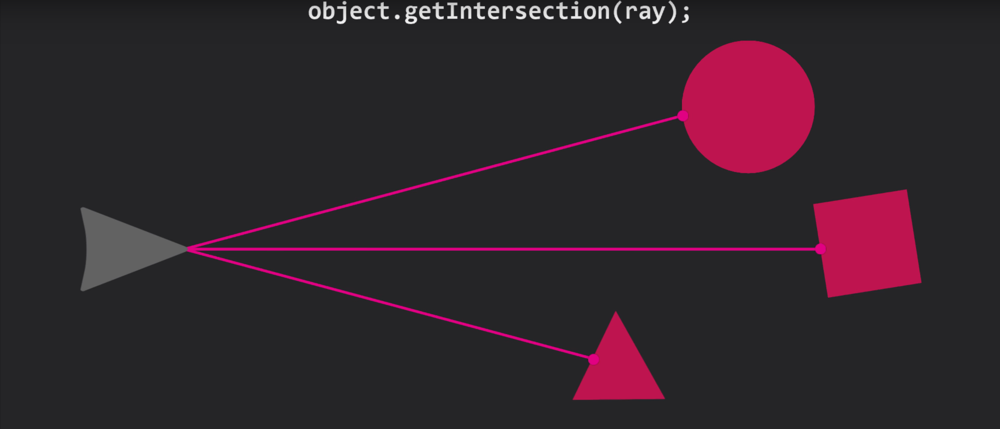
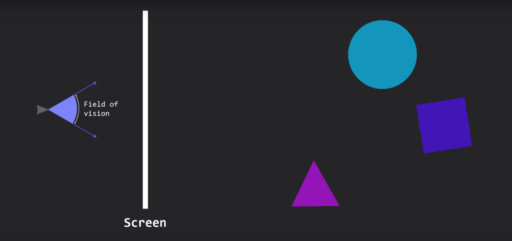
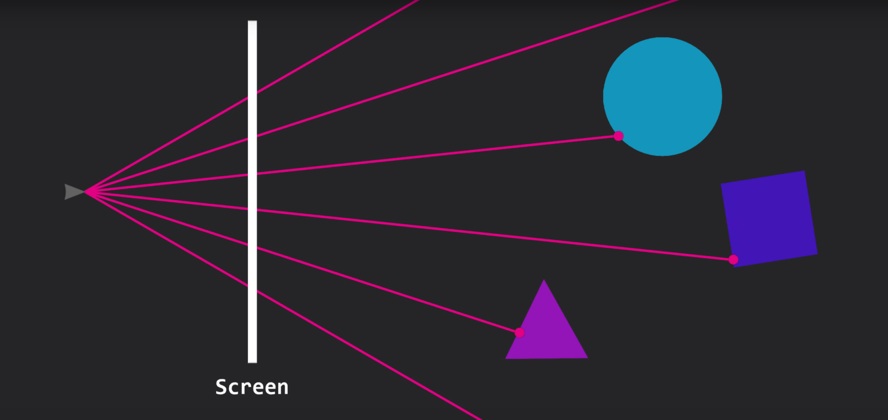
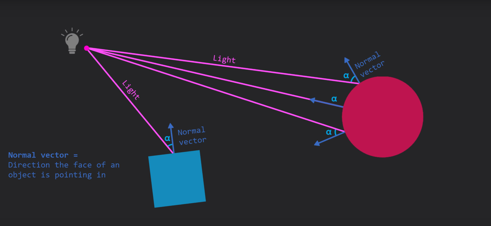
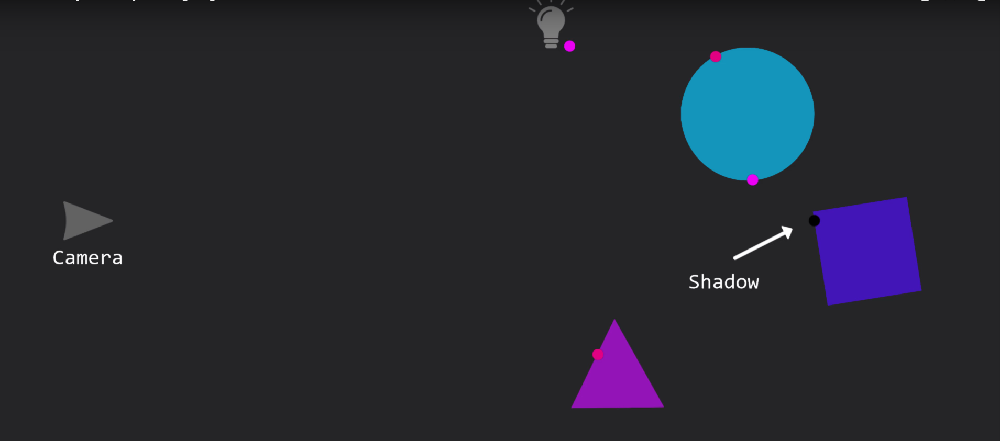
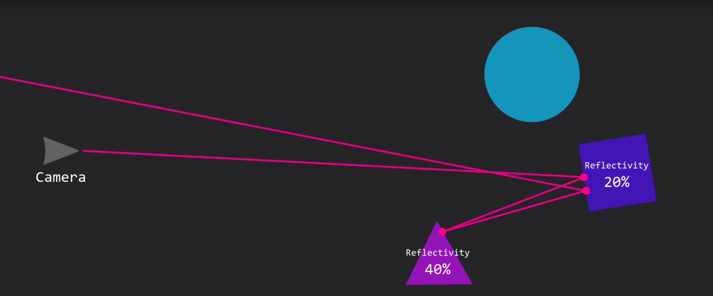

# Raytracing

Raytracing from scratch

## Steps

These plans were based on the amazing [NamePointer's raytracing video](https://www.youtube.com/watch?v=lKIytgt3KXM) from where the images showed here were extracted.

Preparation:

* Create basic canvas window for visualization
* Render basic 2D shapes
* Define the 3D represetntaiton of the objects

Raytracing:

* Define an intersection function for every object in the scene to compute the points where a ray hits a object in 3D space

* Shoot a ray from every pixel of the screen into the scene, if a ray hits an object, that pixel must be colored according to the object's color

* Add perspective, trace rays in an angle around the camera (field of view)

* Add diffuse shadding, the brightness of a pixel should be determined by the angle of which the light touches an object's surface.

* Add camera moviments
* Add plane to the scene
* Add shadows by tracing a ray from every intersection to the light, and check if the ray is blocked by something. If it does, then that pixel should be dark.

* Add reflection by calculation the reflection vector at every intersection, and trace another ray in that direction then the colors at the first intersection are mixed with the color at the second, depending on the reflectivity of the hit object which gives the color of that pixel.

* Add HDRI skybox to the scene using UV mapping 
* Add specular lighting to make reflective objects more shiny. This can be achived by using the angle between the reflected light and the camera to brighten certains areas of the object. 